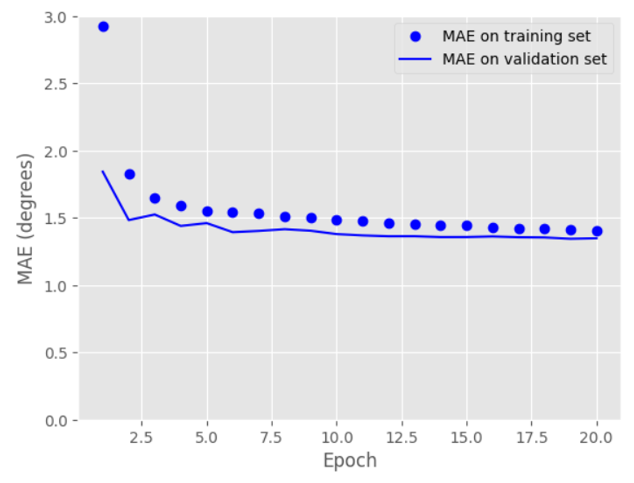
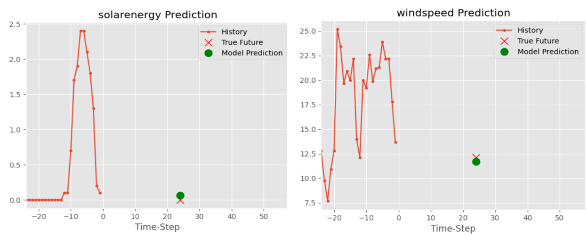

# Forecasting energy availability from renewable sources
In the current climate of soaring energy prices, the company wants to offer a new service by which local clients that are near a source of renewable energy will have free energy when there is a surplus of energy in that area. In this system can reliably predict, at least 24 hours in advance, whether there will be a surplus of either wind or solar energy and it will send out an alert to the customers in the area to allow them to opt-in to the slot.

## Install
install requirements.txt in a Python>=3.11.0 environment
`pip install -r requirements.txt  # install`

## Resourses
**Exploration_preprocessing.ipynb** contains the data exploration code for wether data in colchester and Brighton. Run the notebook and it will extract data form 'weatherdata_for_students' dataset.
By changing filetype you can extract 'brighton' data or 'Colchester' data

`filetype='brighton'`
`for file in file_list:`
    `filenames = file.split('\\')[1].split('_')[0]`

**Modeling.ipynb** notebook contains the Model, trainging and prediction. After running the all cells you can get system Recommendations base in our assumptions 

training

Prediction

Recommendation

## Assumptions
1.   **Wind Energy Calculations**
[Wind Energy](https://www.e-education.psu.edu/emsc297/node/649)

     Power (W) = 1/2 x ρ x A x v3
     Power = Watts
      
*   ρ (rho, a Greek letter) = density of the air in kg/m3  -The standard(link is external) density of air is 1.225 kg/m3
*   A = cross-sectional area of the wind in m2 - The turbine has a 24 m diameter, which means the radius is 12 m. Thus, the swept area of the turbine is: (pi)r2 = 3.14159(122) = 452.4 m2
*   v = velocity of the wind in m/s

2.   **Solar Energy Calculation** - using 4 panale and convert megaW to kiloWatt

3.   **Number of houses in brighton-b5 area.**
        houses - 3,067 [houses](https://www.postcodearea.co.uk/postaltowns/brighton/bn5/)
4.   **average electricity usage per month in UK households is about 350kWh**
[electricity Usage](https://www.ukpower.co.uk/home-energy/average-household-gas-and-electricity-usage)
5.   **Daily usage 350/31 = 11.29 Kwh**

